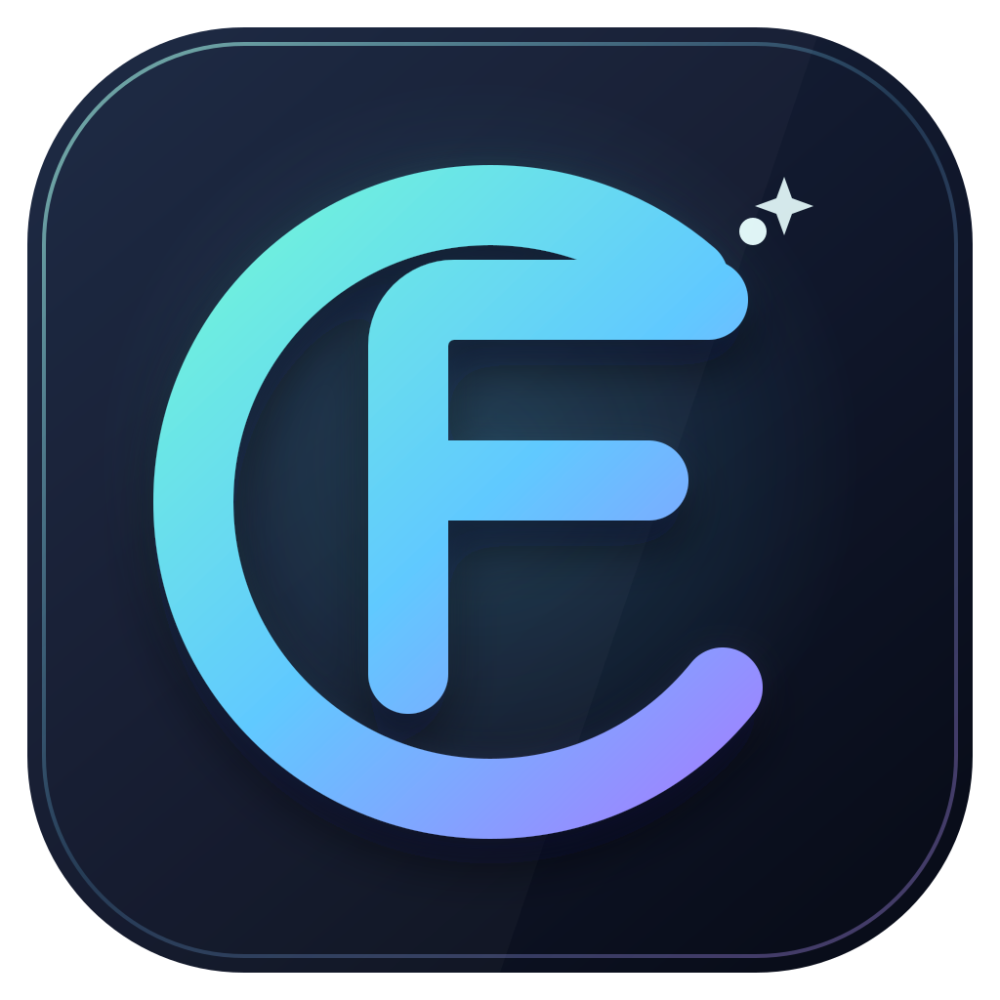
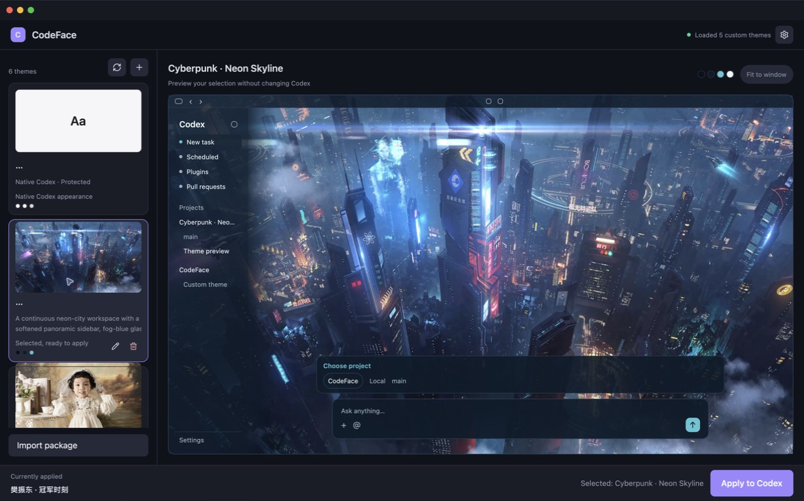
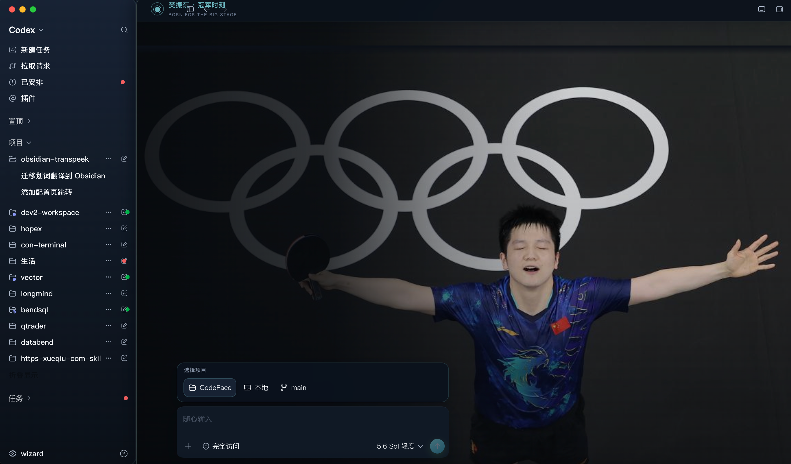
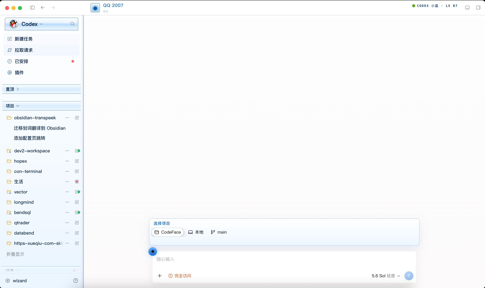

# CodeFace

[English](README.md) | [简体中文](README.zh-CN.md)

<p align="center">
  
</p>


CodeFace is a native, cross-platform appearance manager for the Codex desktop app. Built with Rust and GPUI, it injects theme CSS and the required UI integration code through the Chrome DevTools Protocol (CDP), bound exclusively to the local loopback interface.

CodeFace does not modify the official Codex application, Windows installation, `app.asar`, code signatures, authentication state, or API configuration. Disabling a theme safely restores the official interface.



## Install

Download the latest package from [GitHub Releases](https://github.com/sundy-li/CodeFace/releases/latest):

- **macOS 13 or later:** Download `CodeFace-macOS.zip`, extract it, and move `CodeFace.app` to Applications.
- **Windows:** Download `CodeFace-Windows.zip`, extract it, and run `CodeFace.exe`.

Release builds are currently not notarized or code-signed with a commercial certificate. On macOS, if Gatekeeper blocks the first launch, right-click `CodeFace.app`, choose **Open**, and confirm. Only download builds from this repository's Releases page.

## Features

- Create, edit, import, and switch themes
- Edit `theme.json` and `codeface.css` directly, with CSS syntax highlighting
- Import PNG, JPEG, or WebP background images
- Generate a plain white background automatically when no image is selected
- Preview themes on the home screen with four native shortcut suggestions
- Close or restart Codex from the manager
- English and Simplified Chinese interfaces
- Follow the system language by default, or select a language in Settings
- One shared GPUI interface and Rust core for macOS and Windows


## Theme packs

A theme directory contains:

```text
theme.json
codeface.css
background.png
```

The template is available in [`resources/theme-pack-template`](resources/theme-pack-template). Double-click a theme in the theme list to edit its source directly.

### Built-in themes

CodeFace includes five ready-to-use theme packs. Their full source is available in [`resources/theme-packs`](resources/theme-packs), and the preview images are collected in [`resources/examples`](resources/examples).

| Theme | Preview | Description |
| --- | --- | --- |
| **Cyberpunk · Neon Skyline** |  | A deep-blue cockpit interface with a neon city backdrop, cyan grid lines, and pink and amber accents. |
| **Fan Zhendong · Champion Moment** |  | A restrained dark arena look inspired by a championship moment, with cool blue highlights and a focused portrait backdrop. |
| **Lovely Girl** |  | A warm editorial style built from cream, old-paper, rose, and soft glass-like surfaces. |
| **Messi · World Champion** |  | A bright commemorative theme in Argentina sky blue and trophy gold, paired with a World Cup celebration image. |
| **QQ 2007** |  | A nostalgic compact desktop-software skin with glossy blue panels, beveled controls, and a classic QQ-inspired layout. |

## Why CDP?

Codex does not provide a complete third-party theming API. CodeFace uses the debugging protocol built into Codex's Chromium runtime to add styles at runtime instead of repackaging or modifying the official app.

Security constraints:

- The debugging port binds only to `127.0.0.1`
- WebSocket addresses must pass local host and port validation
- Theme images are limited to 16 MiB and theme CSS to 256 KiB
- Custom CSS cannot load external URLs, fonts, or `@import` rules
- Decorative layers do not intercept pointer events intended for real Codex controls

## Project structure

```text
gui/src/
├── main.rs              GPUI interface and interactions
├── i18n.rs              Language detection, persistence, and translations
├── theme.rs             Theme validation, storage, and image conversion
├── cdp.rs               Rust CDP client, validation, and injector daemon
├── paths.rs             CodeFace data directories
└── platform/
    ├── macos.rs         macOS app discovery and lifecycle
    └── windows.rs       Windows app discovery and lifecycle

resources/
├── assets/              Embedded base CSS and renderer JavaScript
├── i18n/                Embedded JSON translation catalogs
└── theme-pack-template/ Editable theme template

xtask/                   Rust packaging tool
```

The application has no runtime dependency on Shell, PowerShell, AppleScript, or external Node.js. `codeface-inject.js` is compiled into the Rust binary because DOM operations must execute inside the Codex Chromium renderer.

## Development

The current stable Rust toolchain is required.

```bash
cargo test --workspace --locked
cargo clippy --workspace --all-targets --locked -- -D warnings
cargo check --locked -p codeface --target x86_64-pc-windows-gnu
cargo xtask package
```

macOS output:

```text
dist/CodeFace.app
```

Windows output:

```text
dist/windows/CodeFace.exe
```


## Data directories

- macOS: `~/Library/Application Support/CodeFace`
- Windows: `%LOCALAPPDATA%\CodeFace`

## Command-line diagnostics

The same CodeFace Rust executable provides these commands:

```text
codeface --apply-active
codeface --verify 9341
codeface --restore
codeface --print-data-root
```

## Documentation

Start with [`docs/README.md`](docs/README.md) for the user guide, theme-pack format, architecture and security model, development and build instructions, CI and release process, and troubleshooting.

Contributions are welcome. Read [`CONTRIBUTING.md`](CONTRIBUTING.md), follow the [`CODE_OF_CONDUCT.md`](CODE_OF_CONDUCT.md), and report security issues according to [`SECURITY.md`](SECURITY.md).

## Acknowledgements

CodeFace was influenced and inspired by the following post and project:

- [Randy's post on X](https://x.com/randyloop/status/2077813650564452850)
- [Fei-Away/Codex-Dream-Skin](https://github.com/Fei-Away/Codex-Dream-Skin)

## License

MIT. See [LICENSE](LICENSE) and [NOTICE.md](NOTICE.md).
